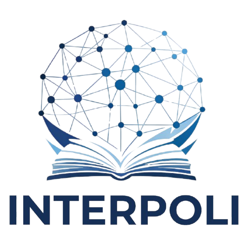

# Início

# Bem-vindo ao INTERPOLI

Nós somos o Grupo de Pesquisa Integridade da Informação e Política Científica (INTERPOLI) da Universidade de São Paulo (USP). Nossas principais linhas de investigação envolvem a comunicação científica na era da Inteligência Artificial, a integridade científica e ética na produção do conhecimento, além de estudos métricos da informação e sua aplicação na Política Científica e Tecnológica.

## Sobre o Grupo
O INTERPOLI surge com o propósito de desenvolver estudos interdisciplinares voltados à análise crítica das práticas, políticas e tecnologias que estruturam a produção, avaliação e disseminação do conhecimento científico. O grupo tem como objetivo contribuir para a promoção da integridade científica, o aprimoramento das políticas de ciência e tecnologia, e a adoção de métricas responsáveis na avaliação da ciência. Entre os resultados esperados estão a elaboração de diagnósticos sobre diretrizes editoriais e práticas institucionais, a proposição de recomendações para órgãos de fomento e revistas científicas, o desenvolvimento de instrumentos de apoio à avaliação científica e a produção de conhecimento que subsidie políticas públicas inclusivas e abertas.

## Linhas de Pesquisa
- **Comunicação Científica na Era da Inteligência Artificial:** Estudar os possíveis usos da inteligência artificial nos processos de comunicação científica, desde a elaboração de pesquisas, passando pela revisão por pares e editoração, até a disseminação dos resultados. A linha investiga os impactos éticos e epistemológicos dessas tecnologias, com atenção ao aumento das retratações e ao risco de desinformação. Também busca incentivar a cultura de boas práticas científicas e fortalecer o papel do bibliotecário como mediador crítico da informação.
- **Estudos Métricos da Informação e sua Aplicação na Política Científica e Tecnológica:** Estudar os indicadores métricos da informação como instrumentos para a formulação, avaliação e monitoramento de políticas científicas e tecnológicas. A linha investiga como esses indicadores, ajudam a traçar perfis nacionais e internacionais da ciência e compreender a evolução das atividades científicas em diferentes áreas do conhecimento. São analisadas tanto métricas quantitativas quanto qualitativas, com apoio de metodologias como análise de conteúdo e revisão sistemática.
- **Integridade Científica e Ética na Produção do Conhecimento:** Investigar diretrizes, políticas institucionais e práticas editoriais voltadas à integridade científica, abordando temas como plágio, autoria, conflito de interesses, uso de softwares de similaridade e desafios éticos da ciência aberta. A linha também visa analisar a atuação de comitês de ética, promover o letramento científico, a gestão responsável de dados e propor estratégias formativas para pesquisadores e instituições comprometidas com uma ciência ética e transparente.

## Últimas Notícias
Novidades do grupo de pesquisa aparecerão aqui em breve.
