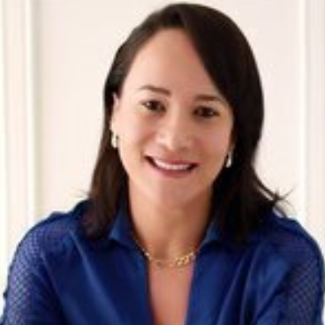
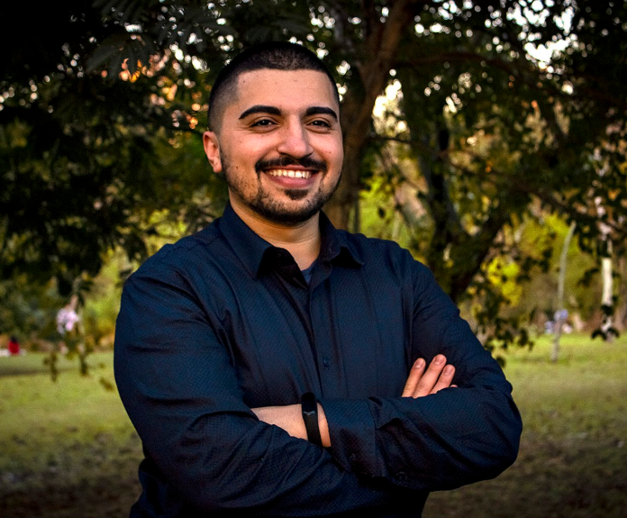
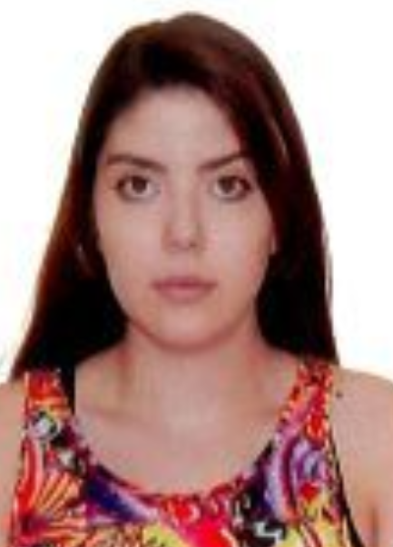

# Pesquisadores

## Coordenação

| Foto | Nome | Titulação | Instituição |
| :---: | :--- | :--- | :--- |
|  | **Ednéia Silva Santos**     | Doutora | DEDIC-FFCLRP/USP e PPGCI-ECA/USP |

---

## Integrantes

| Foto | Nome | Titulação | Instituição |
| :---: | :--- | :--- | :--- |
|  | **Douglas Pallone Vasconcelos dos Santos**     | Mestrando | PPGCI-ECA/USP |
|  | **Eduardo Yukio Garrafa Ishihara**     | Graduando | IME-USP |
|  | **Larissa Alves**     | Doutoranda | PPGCI-ECA/USP |
|  | **Luanda Ferreira Dias de Souza**     | Graduanda | DEDIC-FFCLRP/USP |
|  | **Sofia Dias de Sousa**     | Mestranda | PPGCI-ECA/USP |
|  | **Wesley Pereira Ricardo**     | Mestrando | PPGCI-ECA/USP |
|  | **Yara Arnoni de Camargo**     | Mestranda | PPGCI-ECA/USP |
