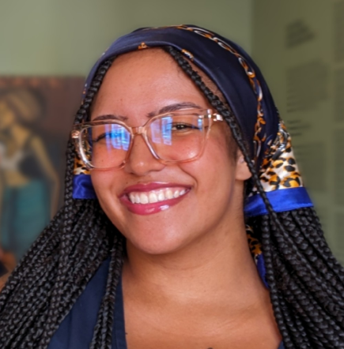
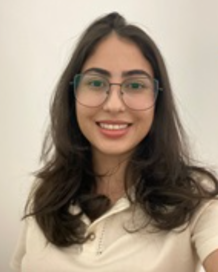
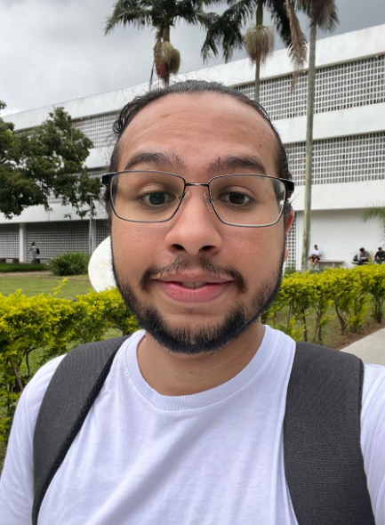

# Pesquisadores

## Coordenação

| Foto | Nome | Titulação | Instituição | Breve Biografia |
| :---: | :--- | :--- | :--- | :--- |
| { width="65" style="border-radius: 50%;" } | **Ednéia Silva Santos**   [{ width="16" }](https://orcid.org/0000-0003-1478-6828) [{ width="16" }](http://lattes.cnpq.br/0671510926276134) | Doutora | DEDIC-FFCLRP/USP e PPGCI-ECA/USP | Doutora em Política Científica e Tecnológica pela Universidade Estadual de Campinas (UNICAMP), mestre em Ciência, Tecnologia e Sociedade pela Universidade Federal de São Carlos (UFSCar) e graduada em Biblioteconomia pela Universidade Estadual Paulista Júlio de Mesquita Filho (UNESP). É Professora Doutora da Universidade de São Paulo (USP), vinculada ao Departamento de Educação, Informação e Comunicação da Faculdade de Filosofia, Ciências e Letras de Ribeirão Preto (FFCLRP/USP), onde atua como docente e supervisora de estágio no curso de Biblioteconomia e Ciência da Informação, sendo ainda chefe do departamento. Também integra o Programa de Pós-Graduação em Ciência da Informação da Escola de Comunicações e Artes da USP, com atuação em disciplinas relacionadas à comunicação científica, bibliometria e integridade científica. |

---

## Integrantes

| Foto | Nome | Titulação | Instituição | Breve Biografia |
| :---: | :--- | :--- | :--- | :--- |
| { width="65" style="border-radius: 50%;" } | **Douglas Pallone Vasconcelos dos Santos**   [{ width="16" }](https://orcid.org/) [{ width="16" }](http://lattes.cnpq.br/8423716199417538) | Mestrando | PPGCI-ECA/USP | Mestrando em Ciência da Informação pela Universidade de São Paulo (USP). Graduado em Enfermagem pela Faculdade de Medicina do ABC (FMABC). |
| { width="65" style="border-radius: 50%;" } | **Eduardo Yukio Garrafa Ishihara**   [{ width="16" }](https://orcid.org/) [{ width="16" }](http://lattes.cnpq.br/5896675221480951) | Graduando | IME-USP | Bacharelando em Estatística pelo Instituto de Matemática, Estatística e Ciência da Computação da Universidade de São Paulo (IME-USP). |
| { width="65" style="border-radius: 50%;" } | **Larissa Alves**   [{ width="16" }](https://orcid.org/0000-0002-0563-8172) [{ width="16" }](http://lattes.cnpq.br/5714545457389700) | Doutoranda | PPGCI-ECA/USP | Doutoranda em Ciência da Informação pelo Programa de Pós-Graduação em Ciência da Informação da Escola de Comunicações e Artes da Universidade de São Paulo (PPGCI-ECA/USP). Mestra em Ciência da Informação pela Universidade de São Paulo - USP (2025), fomentada pela CAPES. Bacharela em Biblioteconomia e Ciência da Informação com ênfase em Cultura e Discurso e Informação Empresarial pela Universidade Federal de São Carlos - UFSCar (2021) e Complementação de Curso Superior em Ciência e Sociedade e Inovação Tecnológica pela mesma instituição (2022). |
| { width="65" style="border-radius: 50%;" } | **Luanda Ferreira Dias de Souza**   [{ width="16" }](https://orcid.org/0009-0005-1443-7451) [{ width="16" }](http://lattes.cnpq.br/8714310367067380) | Graduanda | DEDIC-FFCLRP/USP | Graduanda em Biblioteconomia e Ciência da Informação na Faculdade de Filosofia, Ciências e Letras de Ribeirão Preto, Universidade de São Paulo (FFCLRP-USP) e Graduada em Gestão de Recursos Humanos pela Universidade Presbiteriana Mackenzie (2024). |
| { width="65" style="border-radius: 50%;" } | **Sofia Dias de Sousa**   [{ width="16" }](https://orcid.org/0009-0007-6901-985X) [{ width="16" }](http://lattes.cnpq.br/4620593182525929) | Mestranda | PPGCI-ECA/USP | Mestranda do Programa de Pós-graduação em Ciência da Informação da Escola de Comunicações e Artes da Universidade de São Paulo (ECA-USP). Bacharela em Biblioteconomia e Ciência da Informação pela Faculdade de Filosofia, Ciências e Letras de Ribeirão Preto da Universidade de São Paulo (FFCLRP-USP). |
| { width="65" style="border-radius: 50%;" } | **Wesley Pereira Ricardo**   [{ width="16" }](https://orcid.org/0009-0002-3347-2082) [{ width="16" }](http://lattes.cnpq.br/7254727084982500) | Mestrando | PPGCI-ECA/USP | Mestrando do Programa de Pós-graduação em Ciência da Informação da Escola de Comunicações e Artes da Universidade de São Paulo (ECA-USP). Bacharel em Biblioteconomia e Ciência da Informação pela Faculdade de Filosofia, Ciências e Letras de Ribeirão Preto da Universidade de São Paulo (FFCLRP/USP). |
| { width="65" style="border-radius: 50%;" } | **Yara Arnoni de Camargo**   [{ width="16" }](https://orcid.org/0009-0005-1214-7346) [{ width="16" }](http://lattes.cnpq.br/1953685942065128) | Mestranda | PPGCI-ECA/USP | Mestranda em Ciência da Informação pela Universidade de São Paulo (USP). Graduada em Comunicação Social, com ênfase em Jornalismo pela Pontifícia Universidade Católica de São Paulo (PUC-SP). |
