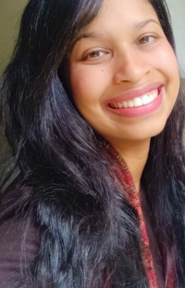

# Mapeamento das iniciativas federais de Ciência Aberta no Brasil e das políticas nacionais de Ciência Aberta na Europa: implicações para a abertura de dados

**Responsável:** Larissa Alves  
**Palavras-chave:** Ciência Aberta; Política Nacional de Ciência Aberta; Iniciativas Federais de Ciência Aberta; Gestão de dados de pesquisa; Integridade de dados de pesquisa; Abertura de dados.  

### Resumo da Pesquisa
A ciência aberta tem se consolidado como um movimento voltado à transparência, ao acesso e à colaboração na produção científica. Entre suas dimensões, destacam-se os dados de pesquisa, relevantes para ampliar a transparência, a reprodutibilidade e o impacto científico. Este estudo em andamento analisa iniciativas federais de ciência aberta no Brasil e políticas nacionais europeias, com foco nas diretrizes e mecanismos relacionados à abertura de dados de pesquisa. Adota abordagem qualitativa, exploratória e descritiva, baseada em análise documental e comparativa. Busca compreender as implicações da ausência de uma política federal consolidada no Brasil, em contraste com países europeus que dispõem de políticas nacionais de ciência aberta. Espera-se evidenciar que a ausência de política federal consolidada no Brasil implica desafios para a padronização das práticas de compartilhamento de dados, enquanto a existência de políticas estruturadas em âmbito nacional favorece práticas consistentes, interoperáveis e orientadas ao reúso. Como contribuição, pretende-se propor recomendações que subsidiem o fortalecimento da governança de dados no Brasil.

---

### Sobre o Pesquisador Responsável

   
   
  <a href="LINK_DO_LATTES" target="_blank">🧬 Currículo Lattes</a> &nbsp;|&nbsp; 
  <a href="LINK_DO_ORCID" target="_blank">🆔 ORCiD</a>

Doutoranda em Ciência da Informação pelo Programa de Pós-Graduação em Ciência da Informação da Escola de Comunicações e Artes da Universidade de São Paulo - PPGCI-ECA/USP (2026-2030). Mestra em Ciência da Informação pela Universidade de São Paulo - USP (2025), fomentada pela CAPES. Bacharela em Biblioteconomia e Ciência da Informação com ênfase em Cultura e Discurso e Informação Empresarial pela Universidade Federal de São Carlos - UFSCar (2021) e Complementação de Curso Superior em Ciência e Sociedade e Inovação Tecnológica pela mesma instituição (2022).
